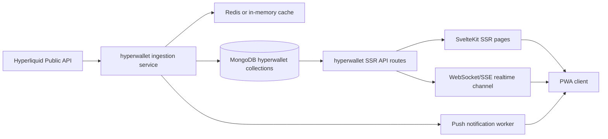
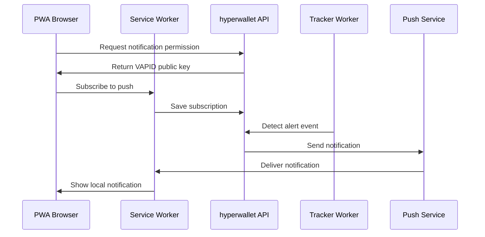

# Hyperwallet Plan

## 1. Goal

Create a separate Svelte PWA SSR project named **hyperwallet** for tracking any Hyperliquid wallet in real time, inspired by HyperTracker.

This project must live in its own folder and remain isolated from the current React/Bun main app:

- Project folder: [`hyperwallet`](hyperwallet/.gitkeep:1)
- Framework: SvelteKit with SSR enabled
- Delivery: PWA installable mobile/web app
- Data access: read-only Hyperliquid APIs, optionally shared Mongo DB/API from the main app
- Main app: do not modify initially
- Security principle: never request private keys; wallet tracking only uses public addresses

The first deliverable in this folder is this plan only. No main-app route, model, service, or UI changes are made yet.

---

## 2. Product Scope

### 2.1 Core MVP

The first production-ready MVP should include:

1. Wallet dashboard
   - Add/read-only track any Hyperliquid wallet address
   - Multi-wallet list
   - Wallet balance, equity, margin summary
   - Last sync timestamp and live status
2. Wallet detail page
   - Open positions
   - Recent fills
   - Historical orders
   - Basic realized/unrealized PnL
   - Risk metrics such as margin usage and liquidation price
3. Market scanner
   - Hyperliquid perp market list
   - Current mid price
   - 24h volume
   - Funding/open interest when available
   - Favorites
4. Alerts
   - Price alerts
   - Wallet activity alerts for followed wallets
   - Local notification permission flow
   - PWA push notification strategy
5. Leaderboard / smart money
   - Public leaderboard source
   - Follow trader into tracked wallet list
   - Smart-money activity notifications
6. Settings
   - Notification preferences
   - Currency preference
   - Theme
   - Refresh interval
   - Export data

### 2.2 Non-goals for MVP

These should be documented but not implemented in the first release unless approved:

- Trading or order placement
- Private-key import
- Account signing
- Custody or wallet connection
- Main-app UI integration
- Full historical PnL reconstruction for all wallets
- Cross-device notification sync without backend

---

## 3. Architecture Decision

### 3.1 Recommended Architecture

Use a small backend inside the SvelteKit SSR project for ingestion, caching, and notifications.



### 3.2 Why a Separate Backend Is Recommended

Although the app is SvelteKit SSR, real-time wallet tracking needs background polling and event processing. SvelteKit server hooks can serve SSR pages, but a dedicated internal service layer is cleaner for:

- Polling tracked wallets every 5-10 seconds
- Comparing fills, positions, and liquidation risk
- Caching market data
- Triggering local/PWA notifications
- Avoiding duplicated Hyperliquid API calls
- Protecting rate limits

### 3.3 DB/API Integration Options

#### Option A - Isolated hyperwallet DB first, API-compatible later

Use a separate database inside the same MongoDB server, for example:

- Main app DB: `celestial`
- Hyperwallet DB: `celestial_hyperwallet`

Collections:

- `tracked_wallets`
- `wallet_snapshots`
- `wallet_fills`
- `wallet_orders`
- `wallet_positions`
- `market_snapshots`
- `price_alerts`
- `wallet_activity_alerts`
- `notification_subscriptions`
- `leaderboard_traders`

Pros:

- No risk to the main app
- Fastest to implement
- Easy to migrate or expose later

Cons:

- Main app cannot immediately consume hyperwallet-derived analytics

Recommended for phase 1.

#### Option B - Shared main Mongo database, separate collections

Use the existing Mongo connection from the main app, defaulting to the same `celestial` DB, but keep all hyperwallet collections prefixed.

Collections:

- `hyperwallet_tracked_wallets`
- `hyperwallet_wallet_snapshots`
- `hyperwallet_wallet_fills`
- `hyperwallet_wallet_orders`
- `hyperwallet_wallet_positions`
- `hyperwallet_market_snapshots`
- `hyperwallet_price_alerts`
- `hyperwallet_wallet_activity_alerts`
- `hyperwallet_notification_subscriptions`
- `hyperwallet_leaderboard_traders`

Pros:

- Main app can later read data
- Easier deployment if only one Mongo DB is used

Cons:

- Slightly higher risk of namespace collision
- Needs collection naming discipline

Recommended if the main app should later display hyperwallet widgets.

#### Option C - Shared main API proxy first

Use the main app's existing Hyperliquid API route:

- Existing route: [`createHyperliquidRoutes()`](src/server/routes/hyperliquid.ts:15)
- Existing service: [`handleHyperliquidRequest()`](src/server/services/hyperliquidService.ts:34)

The hyperwallet app can call the main app API for generic Hyperliquid data, while maintaining its own wallet/alert DB.

Pros:

- Avoids duplicate Hyperliquid client setup
- Reuses existing rate limiter and cache
- Useful for candles, market metadata, and generic API calls

Cons:

- Existing route currently requires auth through [`withAuth()`](src/server/routes/hyperliquid.ts:18)
- PWA public wallet tracking should not depend on main-app auth unless intentionally internal-only
- If used for production, a new public/read-only endpoint should be planned first

Recommended as an optional future API layer, not phase 1.

### 3.4 Recommended Integration Path

Use this staged path:

1. Phase 1: isolated hyperwallet project with its own Mongo DB or separate collection namespace
2. Phase 2: optional API contract document for main-app consumption
3. Phase 3: optional main-app read-only widgets after hyperwallet data model stabilizes

No main-app code should be changed until the API contract is approved.

---

## 4. Main App Context

The current app is a Bun/React dashboard.

Relevant files:

- Runtime entry: [`src/index.ts`](src/index.ts:1)
- Mongo connection helper: [`src/server/db.ts`](src/server/db.ts:1)
- Wallet model service: [`src/server/services/walletsService.ts`](src/server/services/walletsService.ts:1)
- Wallet route: [`src/server/routes/wallets.ts`](src/server/routes/wallets.ts:11)
- Hyperliquid route: [`src/server/routes/hyperliquid.ts`](src/server/routes/hyperliquid.ts:15)
- Generic Hyperliquid request handler: [`src/server/services/hyperliquidService.ts`](src/server/services/hyperliquidService.ts:34)
- Fill sync service: [`src/server/services/syncFills.ts`](src/server/services/syncFills.ts:37)
- Order sync service: [`src/server/services/syncOrders.ts`](src/server/services/syncOrders.ts:45)
- Hyperliquid service wrapper: [`src/server/services/hyperliquid/index.ts`](src/server/services/hyperliquid/index.ts:1)
- Rate limiter: [`src/server/services/hyperliquid/rateLimiter.ts`](src/server/services/hyperliquid/rateLimiter.ts:10)

Important existing conventions:

- Mongo URI defaults to local Docker Mongo when `MONGODB_URI` is unset in non-production.
- Existing wallet data includes sensitive fields, but hyperwallet tracking must avoid private keys.
- Existing Hyperliquid calls are centralized through a shared service and rate limiter.
- Existing routes are registered directly in [`src/index.ts`](src/index.ts:57).

---

## 5. Suggested Project Structure

Create a new SvelteKit project inside [`hyperwallet`](hyperwallet/.gitkeep:1).

Recommended structure:

```text
hyperwallet/
  package.json
  svelte.config.js
  vite.config.ts
  tsconfig.json
  src/
    app.html
    app.d.ts
    routes/
      +layout.svelte
      +page.svelte
      wallets/
        +page.svelte
      wallets/[address]/
        +page.ts
        +page.svelte
      markets/
        +page.svelte
      alerts/
        +page.svelte
      leaderboard/
        +page.svelte
      notifications/
        +page.svelte
      settings/
        +page.svelte
    lib/
      api/
        client.ts
      components/
      stores/
      types/
      utils/
      hyperliquid/
        addresses.ts
        numbers.ts
        symbols.ts
      services/
        walletTracker.ts
        marketScanner.ts
        alertEngine.ts
        notificationService.ts
        leaderboardService.ts
        syncService.ts
    server/
      db.ts
      models/
        TrackedWallet.ts
        WalletSnapshot.ts
        WalletFill.ts
        WalletOrder.ts
        WalletPosition.ts
        MarketSnapshot.ts
        PriceAlert.ts
        WalletActivityAlert.ts
        NotificationSubscription.ts
      routes/
        api/
          wallets/
            +server.ts
          wallets/[address]/
            +server.ts
          markets/
            +server.ts
          alerts/
            +server.ts
          realtime/
            +server.ts
          notifications/
            subscribe/
              +server.ts
      workers/
        trackerWorker.ts
        marketWorker.ts
        alertWorker.ts
        pushWorker.ts
  static/
    icons/
    manifest.webmanifest
    sw.js
  .env.example
  README.md
  plan.md
```

---

## 6. Data Model

### 6.1 TrackedWallet

Purpose: stores user-tracked public wallet addresses.

Fields:

- `address`
- `label`
- `tags`
- `isActive`
- `lastSyncedAt`
- `syncStatus`
- `lastError`
- `createdAt`
- `updatedAt`

Rules:

- Address must be valid Hyperliquid address format.
- No private keys.
- No signing credentials.

### 6.2 WalletSnapshot

Purpose: point-in-time account summary.

Fields:

- `user`
- `accountValue`
- `totalMarginUsed`
- `totalPositionSzi`
- `openPositionCount`
- `marginSummary`
- `liquidationRisk`
- `timestamp`

### 6.3 WalletFill

Purpose: cached fills for tracked wallets.

Fields:

- `user`
- `tid`
- `coin`
- `side`
- `size`
- `price`
- `fee`
- `feeToken`
- `hash`
- `time`
- `closedPnl`
- `liquidation`
- `createdAt`

Indexes:

- `{ user: 1, time: -1 }`
- `{ user: 1, tid: 1 }` unique

### 6.4 WalletOrder

Purpose: cached historical and active orders.

Fields:

- `user`
- `oid`
- `coin`
- `side`
- `size`
- `limitPx`
- `triggerPx`
- `orderType`
- `status`
- `timestamp`
- `statusTimestamp`
- `createdAt`

### 6.5 WalletPosition

Purpose: latest open positions.

Fields:

- `user`
- `coin`
- `szi`
- `side`
- `entryPx`
- `markPx`
- `unrealizedPnl`
- `leverage`
- `liquidationPx`
- `updatedAt`

Indexes:

- `{ user: 1, coin: 1 }` unique

### 6.6 MarketSnapshot

Purpose: cached market metadata and context.

Fields:

- `symbol`
- `name`
- `mid`
- `mark`
- `dayNtlVlm`
- `funding`
- `openInterest`
- `category`
- `assetClass`
- `isFavorite`
- `timestamp`

### 6.7 PriceAlert

Fields:

- `symbol`
- `condition`
- `price`
- `isActive`
- `lastTriggeredAt`
- `createdAt`
- `updatedAt`

### 6.8 WalletActivityAlert

Fields:

- `wallet`
- `alertType`
- `coin`
- `side`
- `threshold`
- `isActive`
- `lastTriggeredAt`
- `createdAt`
- `updatedAt`

### 6.9 NotificationSubscription

Fields:

- `endpoint`
- `p256dh`
- `auth`
- `vapidPublicKey`
- `userId`
- `createdAt`
- `updatedAt`

Note: if no user accounts are used, `userId` can be anonymous or device-scoped.

---

## 7. API Design

### 7.1 Wallet API

`GET /api/wallets`

Response:

```json
{
  "wallets": [
    {
      "address": "0x...",
      "label": "Whale 1",
      "lastSyncedAt": "2026-06-21T04:20:00.000Z",
      "syncStatus": "ok",
      "accountValue": 123456.78,
      "unrealizedPnl": 1234.56
    }
  ]
}
```

`POST /api/wallets`

Body:

```json
{
  "address": "0x...",
  "label": "Whale 1"
}
```

`DELETE /api/wallets/:address`

Deletes the tracked wallet from local hyperwallet DB.

### 7.2 Wallet Detail API

`GET /api/wallets/:address/detail`

Response:

```json
{
  "address": "0x...",
  "summary": {},
  "positions": [],
  "recentFills": [],
  "recentOrders": [],
  "risk": {}
}
```

### 7.3 Market API

`GET /api/markets`

Response:

```json
{
  "markets": [
    {
      "symbol": "ETH-PERP",
      "name": "ETH",
      "mid": "3245.1",
      "dayNtlVlm": "45000000",
      "funding": "0.0001",
      "openInterest": "12345678"
    }
  ]
}
```

### 7.4 Alerts API

`GET /api/alerts`

Returns price and wallet activity alerts.

`POST /api/alerts`

Creates a price or wallet activity alert.

`DELETE /api/alerts/:id`

Deletes an alert.

### 7.5 Realtime API

Recommended options:

1. WebSocket endpoint for live wallet changes
2. Server-Sent Events endpoint for simpler mobile-friendly streaming

Preferred MVP:

`GET /api/realtime`

Events:

```text
event: wallet-updated
data: {"address":"0x...","accountValue":123456,"updatedAt":"..."}

event: position-updated
data: {"address":"0x...","coin":"ETH-PERP","szi":"1.2"}

event: fill-created
data: {"address":"0x...","coin":"ETH-PERP","side":"B","price":"3245.1"}

event: alert-triggered
data: {"alertId":"...","symbol":"ETH-PERP","price":"3500"}
```

---

## 8. SvelteKit PWA Design

### 8.1 SSR Pages

All main pages should be SSR-compatible:

- `/` wallet dashboard
- `/wallets/[address]` wallet detail
- `/markets` market scanner
- `/alerts` alerts
- `/leaderboard` leaderboard
- `/notifications` notification center
- `/settings` settings

### 8.2 PWA Assets

Required:

- `manifest.webmanifest`
- app icons
- service worker
- offline fallback page
- push notification permission flow

### 8.3 PWA Behavior

- Installable from mobile browser
- Offline access to cached wallet and market pages
- Background sync where supported
- Push notifications for alerts where supported
- Graceful fallback to in-app notification center if push is unavailable

---

## 9. Real-time Sync Strategy

### 9.1 Tracked Wallets

Poll interval:

- Default: 5 seconds for active dashboard/detail pages
- Background worker: 10-30 seconds depending on number of wallets
- Adaptive: slower interval when many wallets are tracked

Data to fetch:

- `clearinghouseState` for account summary and positions
- `userFillsByTime` for new fills
- `historicalOrders` for order history
- `openOrders` for active orders

### 9.2 Market Scanner

Poll interval:

- Default: 5-10 seconds
- Cache: 2-5 seconds
- Favorite markets can refresh more frequently

Data to fetch:

- `metaAndAssetCtxs`
- `allPerpMetas`
- optional `recentTrades` for selected market detail

### 9.3 Alert Evaluation

Run after wallet or market updates.

Alert types:

- Price above
- Price below
- Percentage change
- New fill
- Position opened
- Position closed
- Liquidation risk threshold

### 9.4 Notification Flow



---

## 10. UI/UX Plan

### 10.1 Wallet Dashboard

Cards:

- Total tracked account value
- Total unrealized PnL
- Active wallets
- New alerts

List:

- Wallet label
- Address short form
- Account value
- PnL
- Open positions
- Last updated
- Sync status badge

Actions:

- Add wallet
- Open detail
- Rename
- Remove
- Favorite / smart money

### 10.2 Wallet Detail

Sections:

- Header with address, label, last sync
- Summary cards
- Positions table
- Recent fills
- Orders
- PnL chart
- Risk panel

### 10.3 Market Scanner

Features:

- Search by symbol
- Sort by price, 24h change, volume, funding, OI
- Favorite toggle
- Top gainers/losers
- Market detail page later

### 10.4 Alerts

Features:

- Create price alert
- Create wallet activity alert
- Alert list
- Triggered history
- Mute/unmute

### 10.5 Leaderboard

Features:

- Rank
- Trader address
- PnL
- Win rate
- 24h volume
- Follow button

### 10.6 Notifications

Features:

- Unread/read state
- Filter by type
- Notification detail
- Deep link to wallet or market

### 10.7 Settings

Features:

- Notification preferences
- Currency
- Theme
- Refresh interval
- Export data
- Privacy statement

---

## 11. Implementation Phases

### Phase 1 - Project Skeleton

Tasks:

1. Create SvelteKit project in [`hyperwallet`](hyperwallet/.gitkeep:1)
2. Enable SSR
3. Add TypeScript
4. Add Tailwind or preferred styling system
5. Add PWA manifest and service worker
6. Add `.env.example`
7. Add README
8. Add plan file

Output:

- Installable SvelteKit PWA shell
- Basic routes
- No DB changes yet

### Phase 2 - DB and Models

Tasks:

1. Add Mongo connection helper
2. Add Mongoose models
3. Add indexes
4. Add seed script for sample tracked wallets
5. Add collection naming decision:
   - isolated `celestial_hyperwallet`, or
   - prefixed collections in `celestial`

Output:

- DB layer ready
- No main-app code changes

### Phase 3 - Hyperliquid Client

Tasks:

1. Add Hyperliquid API client wrapper
2. Add address validation
3. Add symbol normalization
4. Add number formatting
5. Add rate-limit handling
6. Add error mapping

Output:

- Reusable Hyperliquid data access layer

### Phase 4 - Wallet Tracking

Tasks:

1. Add wallet CRUD
2. Add wallet detail loader
3. Add background tracker worker
4. Cache snapshots, positions, fills, orders
5. Add realtime event emitter

Output:

- Users can track wallets and see live updates

### Phase 5 - Market Scanner

Tasks:

1. Add market metadata sync
2. Add market list API
3. Add favorites
4. Add search and sorting
5. Add top gainers/losers

Output:

- Market scanner page works with cached realtime data

### Phase 6 - Alerts and Notifications

Tasks:

1. Add price alert CRUD
2. Add wallet activity alert CRUD
3. Add alert evaluation engine
4. Add notification subscription API
5. Add service worker push handler
6. Add notification center UI

Output:

- Users receive alerts locally and via PWA push where supported

### Phase 7 - Leaderboard and Smart Money

Tasks:

1. Add leaderboard data source
2. Add leaderboard API
3. Add follow trader flow
4. Add smart money alert creation
5. Add trader detail page later

Output:

- Users can follow public traders into wallet tracking

### Phase 8 - Main App API Contract

Tasks:

1. Document hyperwallet API contract
2. Decide whether main app reads DB directly or via API
3. Add optional main-app route only after approval
4. Add optional main-app widget component only after approval

Output:

- Main app can remain untouched or integrate cleanly later

---

## 12. Security and Privacy

Rules:

- Never request private keys
- Never sign transactions
- Never store private keys
- Use public wallet addresses only
- Use HTTPS in production
- Validate all addresses server-side
- Rate-limit public endpoints if exposed
- Add CORS only for approved origins
- Store push subscription data only when user consents
- Add privacy statement: read-only wallet analytics

---

## 13. Environment Variables

Recommended `.env.example`:

```bash
PORT=3002
MONGODB_URI=mongodb://127.0.0.1:27017/celestial_hyperwallet
HYPERWALLET_DB_NAME=celestial_hyperwallet

# Optional if using shared DB instead
# MONGODB_URI=mongodb://127.0.0.1:27017/celestial
# HYPERWALLET_COLLECTION_PREFIX=hyperwallet_

# Optional if proxying main app API
MAIN_APP_API_URL=http://localhost:3001

# Push notifications
VAPID_PRIVATE_KEY=
VAPID_PUBLIC_KEY=
PUSH_EMAIL=

# Runtime
NODE_ENV=development
```

---

## 14. Open Questions

1. Should hyperwallet use a separate DB name or prefixed collections in the existing `celestial` DB?
2. Should the main app ever display hyperwallet data directly, or should hyperwallet remain standalone?
3. Should wallet tracking require login, or should it be anonymous/local-first?
4. Should push notifications be enabled in phase 1, or should MVP start with in-app notifications only?
5. Should leaderboard data come from Hyperliquid public leaderboard, internal ranking, or both?
6. Should the project use Tailwind, or follow a different UI system?

---

## 15. Recommended Default Decisions

If no further preference is given:

- Use SvelteKit SSR + PWA
- Use separate DB name `celestial_hyperwallet`
- Do not modify the main app in phase 1
- Use anonymous/local-first wallet tracking
- Use in-app notifications first, PWA push in phase 2
- Use Tailwind for UI
- Use existing Hyperliquid public APIs only
- Add main-app API contract after the hyperwallet data model stabilizes

---

## 16. Immediate Next Step

After this plan is approved, create the actual SvelteKit project inside [`hyperwallet`](hyperwallet/.gitkeep:1) and implement Phase 1 skeleton.
